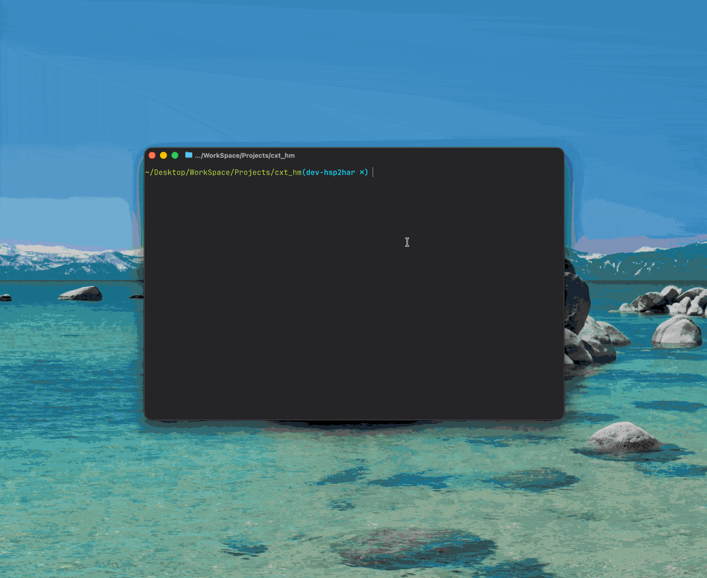

# 鸿蒙无用资源清理工具

扫描 HarmonyOS 项目中未使用的 media 和 rawfile 资源，自动弹出 GUI 面板，支持查看、打开、删除和导出报告。

环境要求：Python 3.9+，无需安装第三方依赖。

## 用法

```bash
python3 find_unused_resources.py [项目根目录]
```

不传参数时默认扫描当前目录。

## GUI 面板



- 双击 → 在文件管理器中打开
- 多选 → Cmd/Ctrl + 点击，支持批量删除
- 右键菜单 → 打开 / 复制名称 / 删除文件
- 键盘 → `Delete` 或 `⌫` 删除，`Return` 打开
- 导出报告 → 生成包含统计概览和分类明细的 TXT 报告
- 重新扫描 → 刷新资源分析结果

## 排除目录

默认跳过 `oh_modules`、`node_modules`、`.hvigor`、`build`、`.preview`、`AppScope`。


# 作者 [@仙银](https://github.com/iHongRen)

鸿蒙开源作品，欢迎持续关注 [Star](https://github.com/iHongRen/https://github.com/iHongRen/) ，[赞助](https://ihongren.github.io/donate.html)

1、[hpack](https://github.com/iHongRen/hpack) - 鸿蒙 HarmonyOS 一键打包上传分发测试工具

2、[Open-in-DevEco-Studio](https://github.com/iHongRen/Open-in-DevEco-Studio)  - macOS  Finder 工具栏 app，使用 DevEco-Studio 打开鸿蒙工程

3、[cxy-theme](https://github.com/iHongRen/cxy-theme) - DevEco-Studio 绿色护眼背景主题

4、[harmony-udid-tool](https://github.com/iHongRen/harmony-udid-tool) - 简单易用的 HarmonyOS 设备 UDID 获取工具，适用于非开发人员

5、[SandboxFinder](https://github.com/iHongRen/SandboxFinder) - 鸿蒙沙箱文件浏览器，支持模拟器和真机

6、[WebServer](https://github.com/iHongRen/WebServer) - 鸿蒙轻量级Web服务器框架，类 Express.js API 风格

7、[SelectableMenu](https://github.com/iHongRen/SelectableMenu) - 适用于聊天对话框中的文本选择菜单

8、[RefreshList](https://github.com/iHongRen/RefreshList) - 功能完善的上拉下拉加载组件，支持各种自定义

9、[hm-app-check-tool](https://github.com/iHongRen/hm-app-check-tool) - macOS 鸿蒙扫描工具，扫描HAP、HSP、App包内容并输出检测结果报告

10、[hm-find-unused-res-tool](https://github.com/iHongRen/hm-find-unused-res-tool) - 鸿蒙无用资源清理工具，一个有UI的 Python 脚本